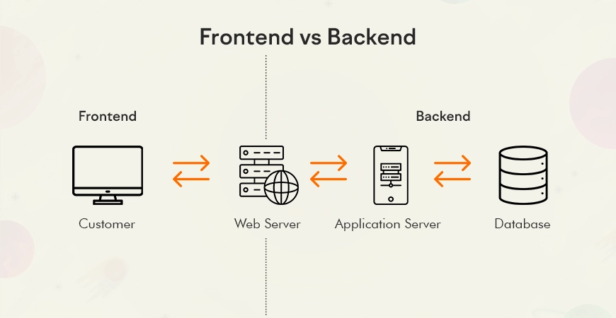

# Unidad 1: Introducción a las Aplicaciones Web

## 1. ¿Qué es una Aplicación Web?
- Una **aplicación web** es un programa que se ejecuta en un servidor y al que accedemos mediante un **navegador web**.  
- Ejemplos: Gmail, Google Docs, Netflix, Amazon...  
- Se diferencia de una **página web estática** (como un blog sencillo o un curriculum online) en que es **interactiva**: el usuario puede enviar información y recibir respuestas personalizadas.

---

## 2. Página Web vs Aplicación Web
| Característica         | Página Web (Web Estática)        | Aplicación Web (Web Dinámica)      |
|-------------------------|----------------------------------|-------------------------------------|
| Contenido              | Fijo (no cambia mucho)           | Dinámico (cambia según el usuario) |
| Interactividad         | Muy limitada                     | Alta (formularios, botones, chats) |
| Ejemplo                | Blog personal, web informativa   | Gmail, banca online, e-commerce    |

---

## 3. Frontend y Backend
- **Frontend**:
  - Parte de la aplicación web que se ejecuta en el cliente(navegador).
  - Parte visible para el usuario (interfaz).
  - Al tener que ser compatible con todos los clientes/navegadores las tecnologias estan estandarizadas.
  - Las tecnologías utilizadas siempre son:
    - **HTML**: estructura de la página.
    - **CSS**: estilo (colores, tamaños, fuentes).
    - **JavaScript**: algo de lógica e interactividad.

- **Backend**:
  - Parte de la aplicación web que se ejecuta en el cliente(navegador).
  - Gran parte de la lógica de la aplicación ocurre aquí, en el **servidor**. Como por ejemplo procesar datos, acceder a la base de datos, autenticar usuarios.
  - Algunas lenguajes comunes son Java, Python, PHP, Ruby o JavaScript

---

## 4. Modelo Cliente-Servidor
- **Cliente**: el navegador (Chrome, Firefox, Edge…).
- **Servidor**: ordenador remoto que ejecuta la aplicación web.
- Funcionamiento básico:
  1. El cliente hace una **petición (request)**.
  2. El servidor procesa la petición y devuelve una **respuesta (response)**.
  3. El navegador interpreta el resultado y lo muestra al usuario.

**Esquema:**

 

---

## 5. Servidor Web vs Servidor de Aplicacion
Aunque a veces se usen juntos, no son lo mismo:

### Servidor Web
- Es un **servidor HTTP**.  
- Recibe peticiones HTTP del navegador y responde los recursos web solicitados.
- Su función principal es **enviar el frontend** al cliente: HTML, CSS, JavaScript, imágenes u otros recursos.  
- Cabe aclarar que el frontend no se almacena en el cliente, sino que se descarga desde el servidor web cada vez que se accede a la aplicación.
- Ejemplos: **Apache**, **Nginx**, **Live Server**.

---

### Servidor de Aplicaciones
- Se encarga de **ejecutar el backend**: la lógica de la aplicación.  
- Procesa datos, realiza cálculos, valida usuarios, se comunica con bases de datos...  
- Genera contenido dinámico y se lo pasa al servidor web para que llegue al navegador.  
- Ejemplos: **Tomcat**, **Node.js (framework)**.

## 5. Papel del Navegador
- Interpreta el **código HTML, CSS y JS** en una interfaz visual.
- Envía y recibe información del servidor.
- Permite ejecutar código JavaScript en el lado del cliente.

---

## 6. Protocolos Importantes
- **HTTP/HTTPS**: protocolo para la transferencia de páginas web.
  - HTTPS añade seguridad (cifrado con TLS).
- **FTP**: transferencia de archivos (cada vez menos usado en web pública).
- **SMTP, IMAP, POP3**: protocolos relacionados con el correo electrónico.
- **WebSockets**: permiten comunicación bidireccional en tiempo real (ejemplo: chats).

---

## 7. Arquitectura en Capas de Aplicaciones Web**
Organiza cómo se estructura el **código y la lógica** de una aplicación web.  
Suele dividirse en **3 capas principales**:

- **Capa de Presentación (Frontend)**  
  - Lo que ve el usuario (interfaz).  
  - Tecnologías: HTML, CSS, JavaScript.  

- **Capa de Lógica o Negocio (Backend)**  
  - Procesa la lógica de la aplicación.  
  - Se encarga de cálculos, validaciones, autenticaciones... 

- **Capa de Datos**  
  - Bases de datos donde se guardan los registros.  
  - Ejemplos: MySQL, PostgreSQL, MongoDB, Redis... 

**Esquema típico de 3 capas:**
 

---

## 8. Evolución de la Web
- **Web 1.0** (años 90):
  - Páginas estáticas.
  - Información unidireccional.
  - Ejemplo: primeras webs de periódicos.

- **Web 2.0** (2000s):
  - Contenido dinámico e interactivo.
  - Redes sociales, blogs, wikis.
  - El usuario no solo lee, también **participa**.

- **Web 3.0** (actualidad y futuro):
  - Basada en inteligencia artificial, datos masivos y blockchain.
  - Aplicaciones descentralizadas.
  - Mayor personalización.

---

## 9. Herramientas y Lenguajes Usados
- **Frontend**:
  - HTML, CSS, JavaScript.
  - Frameworks: React, Angular, Vue.js.
- **Backend**:
  - Lenguajes: Python, Java, PHP, C#, Go.
  - Frameworks: Node.js, Django, Spring, Laravel.
- **Bases de datos**:
  - Relacionales: MySQL, PostgreSQL.
  - NoSQL: MongoDB, Redis.
- **Otros**:
  - Git/GitHub para control de versiones.
  - Docker para despliegue.
  - Servidores web: Apache, Nginx.

---

## 10. Resumen Final
- Una aplicación web es **dinámica, interactiva y cliente-servidor**.  
- El **frontend** es lo que ve el usuario; el **backend** maneja la lógica y los datos.  
- La web ha pasado de ser estática (**Web 1.0**) a interactiva (**Web 2.0**) y ahora busca ser inteligente y descentralizada (**Web 3.0**).   
- El **navegador** es la puerta de entrada a todo este ecosistema.  

